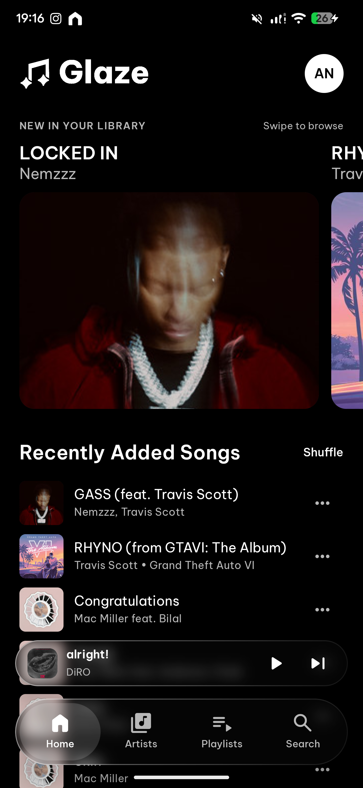
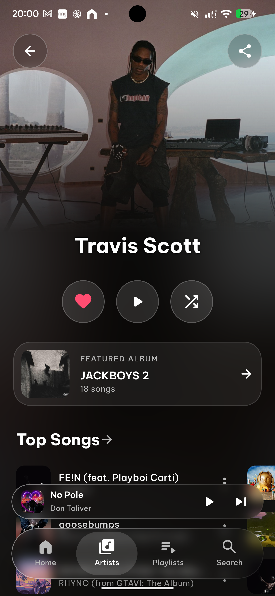
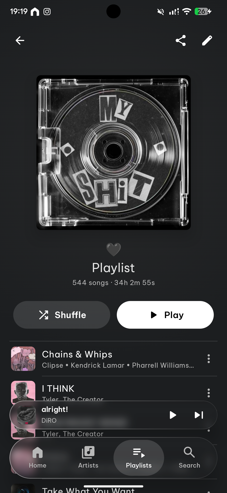
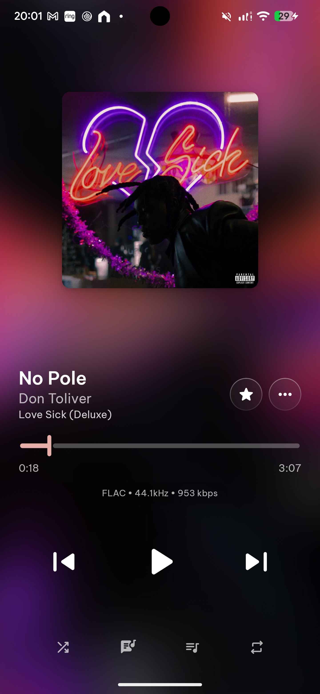

<div align="center">
  <picture>
    <source media="(prefers-color-scheme: dark)" srcset="shared/src/commonMain/composeResources/drawable/glaze_wordmark.png">
    
  </picture>

  <p>Your self-hosted music library, beautifully yours.</p>

  <p>
    <a href="https://github.com/ILostXD/Glaze/releases">Download the latest alpha</a>
    · <a href="#build-from-source">Build from source</a>
    · <a href="https://github.com/ILostXD/Glaze/issues">Report an issue</a>
  </p>
</div>

Glaze is an Android music player for [Navidrome](https://www.navidrome.org/) and other Subsonic-compatible servers. Browse the library you host, explore artists and albums, and listen with a player designed around the music's artwork. Glaze is a client: you need your own server and music library.

<div align="center">
  
  
  
  
</div>

<p align="center"><sub>Home · Artist · Playlist · Now Playing — captured from a development build. Music and artwork shown are not included with Glaze.</sub></p>

> [!NOTE]
> Glaze is in alpha. Expect rough edges, and use the [pre-release APKs](https://github.com/ILostXD/Glaze/releases) for testing rather than as a production-critical player. Current alpha APKs are debug-signed and installed manually.

## What you can do

- Browse and search songs, albums, artists, and playlists from your Subsonic-compatible library.
- Play in the background with Android media controls; manage the queue, shuffle, and view lyrics when available.
- Explore artwork-led album and artist pages, favorite music, and edit playlist order.
- Choose light or dark mode and tune the mini-player, navigation, glass intensity, and gestures in Settings.
- Start a Jam from Now Playing’s song actions to share a queue with friends on the same Navidrome library.

## Get started

1. Install the APK from the [latest GitHub release](https://github.com/ILostXD/Glaze/releases) on an Android 8.0 (API 26) or newer device.
2. Open Glaze and enter your server URL, username, and password.
3. Start browsing your library. Use an **HTTPS** server URL when connecting over the internet; plain HTTP should only be used on a network you trust.

Glaze checks the connection before saving your account. Credentials are stored using Android Keystore-backed encryption, and Subsonic requests use salted token authentication. The app does not provide a music catalog or host your files.

Jam needs a separate [Glaze Companion](https://github.com/ILostXD/GlazeCompanion) server over HTTPS. The host enters its companion admin token once; guests need only the server address and the invite code shared from the Jam sheet. Guest playback uses each phone’s own Navidrome connection, so everyone needs access to the same library. Invites, queue voting and host-controlled playback are supported; nearby discovery and QR invites are not yet implemented.

## Build from source

You need JDK 17 or newer, Android SDK 36, and an Android device or emulator. Open the project in Android Studio, or use the Gradle wrapper:

```powershell
.\gradlew.bat :app:assembleDebug
```

On macOS or Linux, use `./gradlew :app:assembleDebug`. The APK is written to `app/build/outputs/apk/debug/app-debug.apk`.

Run the local tests with:

```powershell
.\gradlew.bat :app:testDebugUnitTest :shared:testDebugUnitTest
```

Live playback and server-dependent behavior require a reachable Navidrome/Subsonic account and an Android device or emulator.

The project has two modules: `shared` holds the Subsonic client and Compose UI; `app` provides Android credential storage and the Media3 playback service.

## AI-assisted development

Glaze was made with **AI-assisted coding**. AI tools have helped implement and refine code, tests, and documentation under human direction. As with any alpha software, review the source and test a build before relying on it.

## License

Glaze is licensed under the [GNU General Public License v3.0](LICENSE). It is not affiliated with Navidrome or the artists whose artwork may appear in screenshots.
